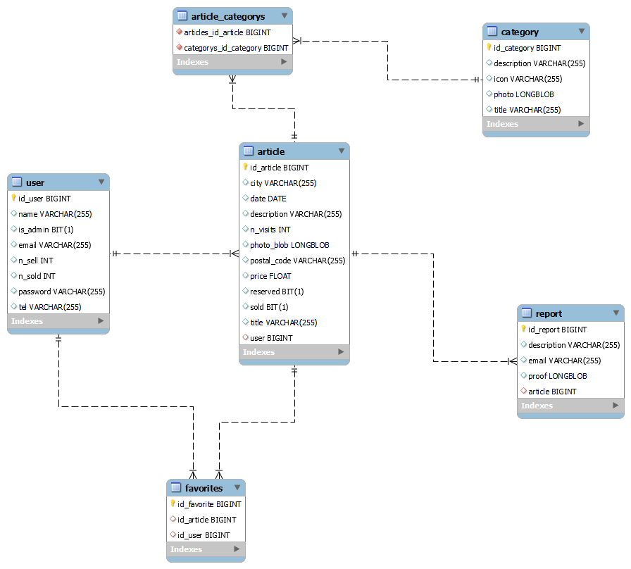
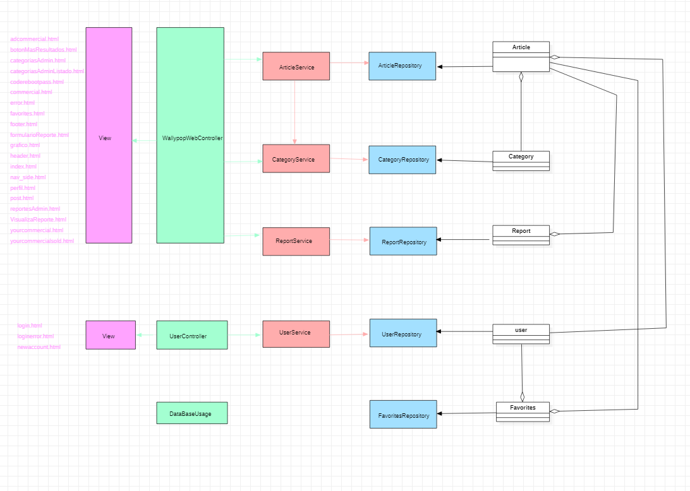

# APP: WALLYPOP

### "En busca de Wally"

### Nos gusta que no se malgasten recursos, por esta razón nuestra app favorece la rehutilización de los productos, frente a deshacerse de ellos y adquirir nuevos productos.
### Nuestra app pondrá en contacto a las personas para ayudarles en el intecambio de productos.

# Fase 0

## Nombre de equipo y logo

## Eslogan

### "Nos gusta ser libres a la vez que responsables y el trabajo bien hecho"

## Equipo de desarrollo - Grupo 4
| Nombre	| Email	| Github |
| --- | :---: | :---: |
|Jesús Barcia Ares| j.barcia.2019@alumnos.urjc.es| jbarcia2019|
|Sergio Gómez García |s.gomezg.2019@alumnos.urjc.es|sergio-gomezg|
|Juan Diez del Corral Ramos |j.diez.2019@alumnos.urjc.es|Juandiezdc|
|Iván Martín Gómez |i.martingo.2016@alumnos.urjc.es|IvanmgmSoftwareEngineering|

## Trello

https://trello.com/b/CO5xGXpN/daw-2021-2022

 ## **Temática** 
 * Tienda de compra/venta de productos de segunda mano.

## Aspectos principales

### Entidades
* **Usuarios:** Podremos encontrar tres tipos de usuarios, no registrados, registrados y administradores.
* **Anuncio:** Está relacionado con los usuarios, ya que estos serán los que podrán poner artículos a la venta o comprar los de otros usuarios.
* **Reportes:** Los usuarios pueden realizar reportes de anuncios o de usuarios fraudulentos. Para ello tendrán un cuadro de diálogo en el que especificar el motivo, un email de contacto y subir alguna imagen como prueba del reporte.
* **Categorías:** Podremos encontrar las distintas categorías de los productos que se encuentran anunciados.

### Permisos de los usuarios
* **Usuarios no registrados:** Podrán ver los artículos puestos a la venta, pero no podrán realizar ni compras ni ventas.
* **Usuarios registrados:** Podrán ver los artículos puestos a la venta, y además podrán vender un producto o comprar el de otro usuario.
* **Administradores:** Podrán ver los artículos puestos a la venta, los usuarios registrados y podrán eliminar productos y usuarios.

### Imágenes
* **Imágenes de perfil:** Los usuarios registrados y administradores podrán establecer una imagen de perfil.
* **Imágenes de productos:** Los usuarios registrados podrán subir imágenes junto a los productos que pongan a la venta.

### Gráficos
* **Gráfica ranking usuarios con más ventas:** se podrá consultar los usuarios que más ventas han realizado.
* **Gráfico peores usuarios:** (visible para el administrador) se podrá consultar que usuarios han recibido más reportes y en el caso de que sean malos usuarios se pueda suspender su cuenta.

### Tecnología complementaria
* **Envío de correos electrónicos:** Podremos comunicarnos con los usuarios a través del uso del correo electrónico para realizar la compra-venta.
* **Localización por mapas:** Podremos ver la ubicación aproximada del producto que queremos adquirir.

### Algoritmo o consulta avanzada
* Búsqueda de artículos por una o varias etiquetas de categorías
* La web recomendará a los usuarios productos similares a los adquiridos anteriormente

# Fase 1

## Pantalla principal

### Esta será la primera pantalla que vean los usuarios al acceder a la web

## Añadir producto

### Los usuarios registrados podrán subir un producto visible por el resto de usuarios

## Añadir categoría

### El administrador podrá añadir una nueva categoría visible para el resto de usuarios

## Listado de categorías

### El administrador podrá visualizar las categorías añadidas por él previamente 

## Recuperar contraseña

### Los usuarios podrán recuperar la contraseña de su cuenta en caso de olvidarla

## Listado de productos

### Los usuarios podrán visualizar todos los productos subidos subidos que no estén vendidos

## Formulario de denuncias

### Los usuarios podrán rellenar un formulario de denuncia en el caso de considerar un producto inapropiado

## Gráfico

### Se podrá ver un grafico con el ranking de usuarios que mas han vendido tanto mensualmente como su histórico

## Pantalla de ayuda

### Los usuarios podrán consultar una pantalla de ayuda en caso de tener alguna duda

## Iniciar sesión

### Los usuarios registrados y el administrador podrán iniciar sesión para acceder a su cuenta

## Registrarse

### Los usuarios no registrados podrán hacerse una cuenta en la web

## Perfil usuario

### Pantalla que verán los usuarios registrados

## Perfil administrador

### Pantalla que verá el administrador

## Publicación

### Pantalla que podrán ver los usuarios con la información del producto seleccionado
### Los usuarios no registrados verán solo los botones verdes, al igual que los registrados si el producto es de otro usuario o todos los botones si es un artículo propio, al igual que el administrador

## Listado de reportes

### El administrador podrá consultar las denuncias recibidas por los usuarios

## Visualizar reporte

### El administrador podrá consultar las pruebas adjuntas a la denuncia seleccionada

## Tus productos

### Los usuarios podrán ver los productos que han subido a su perfil

## Tus productos vendidos

### Los usuarios podrán ver los productos que han subido a su perfil y que ya se hayan vendido

## Diagrama de navegación

# Fase 2

## Diagrama de Bases de datos

## Diagrama de clases y templates

## Diagrama de navegación actualizado

## Contribución miembros equipo

### Contribución Jesús:

#### Descripción textual

##### Diseño base de datos
##### Usuarios (entidad, login, registro, perfil)
##### Entidad de favorites
##### Securizar aplicaci?n
##### Generar certificado jks
##### Mapas
##### Envío de correos electrónicos
##### Mostrar detalle de cada artículo publicado (reservar, vender, eliminar)
##### Migraci?n a PostgreSQL
##### Menús html y footer

#### 5 Commits más significativos:

##### Registro funcionando: https://github.com/CodeURJC-DAW-2021-22/webapp4/commit/b7a6c7414f36a81cffe26e1f2402954133d6b0eb
##### Envío de correos electrónicos: https://github.com/CodeURJC-DAW-2021-22/webapp4/commit/407ff4441023080f7d8c861946d124cefd6252cc
##### Mapas: https://github.com/CodeURJC-DAW-2021-22/webapp4/commit/5eb75b47eb04021b5d838486af7ae37ba2f6034a
##### Encriptado de las contrase?as: https://github.com/CodeURJC-DAW-2021-22/webapp4/commit/407ff4441023080f7d8c861946d124cefd6252cc
##### Certificado jks propio: https://github.com/CodeURJC-DAW-2021-22/webapp4/commit/407ff4441023080f7d8c861946d124cefd6252cc

#### 5 ficheros mayor participaci?n:

##### https://github.com/CodeURJC-DAW-2021-22/webapp4/blame/main/backend/src/main/java/es/codeurjc/wallypop/controller/WallypopWebController.java
##### https://github.com/CodeURJC-DAW-2021-22/webapp4/blob/main/backend/src/main/java/es/codeurjc/wallypop/security/WebSecurityConfig.java
##### https://github.com/CodeURJC-DAW-2021-22/webapp4/blob/main/backend/src/main/resources/templates/post.html
##### https://github.com/CodeURJC-DAW-2021-22/webapp4/blob/main/backend/src/main/java/es/codeurjc/wallypop/service/MapService.java
##### https://github.com/CodeURJC-DAW-2021-22/webapp4/blob/main/backend/src/main/java/es/codeurjc/wallypop/controller/UserController.java

### Contribución Iván:

#### Descripción textual

##### He participado en la implementación de la funcionalidad de añadir nuevos art?culos (formulario, botón enviar) a la base de datos.
##### He participado en la implementación de la funcionalidad de cargar artículos almacenados en la base de datos para mostarlos al usuario.
##### Mostrar mensaje de Enhorabuena!... cuando un artículo es almacenado con ?xito en la base datos.
##### Redacción y e intento de descarga de documento de T&C (Terms and Conditions)
##### Intento de implementaci?n de paginación con AJAX
##### Añadir datos de prueba a la base datos de art?culos (+5 categorías y +11 artículos)
##### Realizado el diagrama de clases y templates

#### 5 Commits más significativos:

##### Cargar datos desde la base de datos en orden inverso: https://github.com/CodeURJC-DAW-2021-22/webapp4/commit/92fb7e7b8669327e66fa8310b898769463b86599
##### Mensaje enhorabuena y solución de problemas: https://github.com/CodeURJC-DAW-2021-22/webapp4/commit/67e119a898c13a5df04d1d618d903c2925845e22
##### Quitar botones paginación simple, añadir nuevo botón "Más resultados": https://github.com/CodeURJC-DAW-2021-22/webapp4/commit/92fb7e7b8669327e66fa8310b898769463b86599
##### Añadir progress bar: https://github.com/CodeURJC-DAW-2021-22/webapp4/commit/ac017cc0bb688609f34474c268814cb150d0620b
##### Añadir +5 categorías y +11 art?culos a la base de datos (paso previo a la implementación de la paginación con AJAX) https://github.com/CodeURJC-DAW-2021-22/webapp4/commit/baffa3426997521405ec57ceafe75c54dfc139d4

#### 5 ficheros mayor participación:

##### https://github.com/CodeURJC-DAW-2021-22/webapp4/blob/FNI_Article_3/backend/src/main/java/es/codeurjc/wallypop/controller/WallypopWebController.java
##### https://github.com/CodeURJC-DAW-2021-22/webapp4/blob/FNI_Article_3/backend/src/main/java/es/codeurjc/wallypop/controller/DataBaseUsage.java
##### https://github.com/CodeURJC-DAW-2021-22/webapp4/blob/FNI_Article_3/backend/src/main/java/es/codeurjc/wallypop/service/ArticleService.java
##### https://github.com/CodeURJC-DAW-2021-22/webapp4/blob/FNI_Article_3/backend/src/main/resources/templates/adcommercial.html
##### https://github.com/CodeURJC-DAW-2021-22/webapp4/blob/FNI_Article_3/backend/src/main/resources/templates/yourcommercial.html

### Contribución Sergio:

#### Descripción textual

##### He hecho que un administrador pueda añadir nuevas categorias
##### He hecho que un administrador pueda eliminar categorias
##### He ayudado a implementar los favoritos
##### He añadido datos de ejemplo a la base de datos para comprobar el uso correcto del añadir y eliminar categorias
##### He realizado el diagrama de navegación
##### He implementado que un usuario pueda modificar el nombre, contraseña y telefono de su perfil

#### 5 Commits más significativos:

##### Modificar datos de los usuarios: https://github.com/CodeURJC-DAW-2021-22/webapp4/commit/d3dbf0034dfdcfc2c5706aa81e1e0deeec823bb2
##### Añadir y eliminar favoritos: https://github.com/CodeURJC-DAW-2021-22/webapp4/commit/14897b6be8888828be30363b54d2f03fbc9fdfed
##### Eliminar categorias a los articulos: https://github.com/CodeURJC-DAW-2021-22/webapp4/commit/904517997bea056f4d2d0dc36eef6df3f6f66815
##### Cargar articulos asociados a una categoria seleccionada en la pantalla principal: https://github.com/CodeURJC-DAW-2021-22/webapp4/commit/5fcf1532bf9264206142938235d82d0edfc26169
##### Mostrar categorias en la pantalla principal: https://github.com/CodeURJC-DAW-2021-22/webapp4/commit/aa713690a0fb9baac59ce4b22d1207591695d3eb

#### 5 ficheros mayor participación:

##### https://github.com/CodeURJC-DAW-2021-22/webapp4/blame/FIX_AND_NEW_IMPLEMENTATIONS/backend/src/main/java/es/codeurjc/wallypop/model/Category.java
##### https://github.com/CodeURJC-DAW-2021-22/webapp4/blame/FIX_AND_NEW_IMPLEMENTATIONS/backend/src/main/java/es/codeurjc/wallypop/controller/DataBaseUsage.java
##### https://github.com/CodeURJC-DAW-2021-22/webapp4/blame/FIX_AND_NEW_IMPLEMENTATIONS/backend/src/main/java/es/codeurjc/wallypop/controller/WallypopWebController.java
##### https://github.com/CodeURJC-DAW-2021-22/webapp4/blame/FIX_AND_NEW_IMPLEMENTATIONS/backend/src/main/resources/templates/modifyDataUser.html
##### https://github.com/CodeURJC-DAW-2021-22/webapp4/blame/FIX_AND_NEW_IMPLEMENTATIONS/backend/src/main/resources/templates/index.html

### Contribución Juan:

#### Descripción textual

##### He participado en la creacion y guardado en base de datos de los formularios de reporte
##### He participado en la lista de reportes que debe salir de la base de datos para mostrarse al administrador
##### He participado en la visualizacion individual de los reportes que permite al administrador aceptarlo o rechazarlo
##### He participado en la creacion y borrado de favoritos 

#### 5 Commits más significativos:

##### Rellenar formulario de reportes y enviarlo a la base de datos. https://github.com/CodeURJC-DAW-2021-22/webapp4/commit/8c57c2277999f69edc5648367537af2456d0f960
##### Mostrar lista de reportes al administrador. https://github.com/CodeURJC-DAW-2021-22/webapp4/commit/0ef1d4185c030ab3e1f5e6975f499d5cdb984df8
##### Visualizar Reporte completo.https://github.com/CodeURJC-DAW-2021-22/webapp4/commit/9c32a53c28d3b50db5028c883ffdfad3bbd621b4
##### Funcionalidad de eliminar articlo reportado o eliminar reporte.https://github.com/CodeURJC-DAW-2021-22/webapp4/commit/bed1f9db220cb8c52eb243809f2b63ca504b9b65
##### Añadir articlos favoritos a la lista de favoritos de un usuario.https://github.com/CodeURJC-DAW-2021-22/webapp4/commit/019a78bcc6cadc81bc84c2144cedcc746f1c1bcd

#### 5 ficheros mayor participación:

##### https://github.com/CodeURJC-DAW-2021-22/webapp4/blob/FNI_Favorites/backend/src/main/java/es/codeurjc/wallypop/controller/WallypopWebController.java
##### https://github.com/CodeURJC-DAW-2021-22/webapp4/blob/FNI_Favorites/backend/src/main/java/es/codeurjc/wallypop/service/FavoritesService.java
##### https://github.com/CodeURJC-DAW-2021-22/webapp4/blob/FNI_Favorites/backend/src/main/resources/templates/VisualizaReporte.html
##### https://github.com/CodeURJC-DAW-2021-22/webapp4/blob/FNI_Favorites/backend/src/main/resources/templates/reportesAdmin.html
##### https://github.com/CodeURJC-DAW-2021-22/webapp4/blob/FNI_Favorites/backend/src/main/resources/templates/formularioReporte.html

# Intrucciones ejecución

* JavaSE 17
* Spring Boot
* Docker (Base de datos PostgreSQL): docker run -d --name postgres-server -p 5433:5432 -e "POSTGRES_PASSWORD=password" postgres
* Docker Hub: docker run -d --publish 8443:8443 jesusbarcia/wallypop
* Heroku: https://wallypop-web.herokuapp.com/

## Dependencias Maven: 
* **org.springframework.boot:**
   * spring-boot-starter-data-jpa
   * spring-boot-starter-mustache
   * spring-boot-starter-web
   * spring-boot-starter-security
   * spring-boot-devtools
* **com.h2database:** 
   * H2 (Sólo en el caso de que se ejecute la aplicación sobre H2, en lugar de sobre PostgreSQL)
* **org.postgresql**
   * postgresql
* **com.sun.mail:**
   * javax.mail (v1.6.2)

## Licencia
[APACHE](https://github.com/CodeURJC-DAW-2021-22/webapp4/blob/26b1d22bc7625b0dd8cdb3a3b8eaf7bb5425833b/LICENSE)
