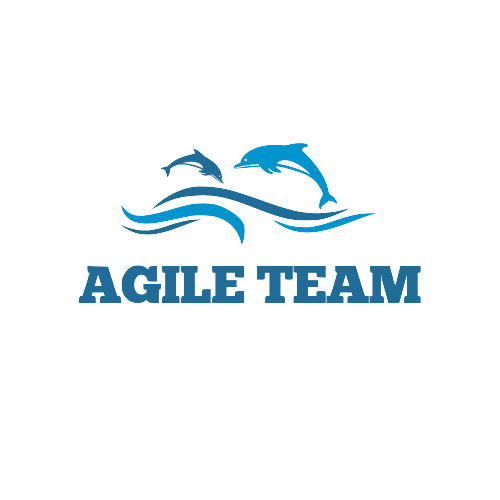
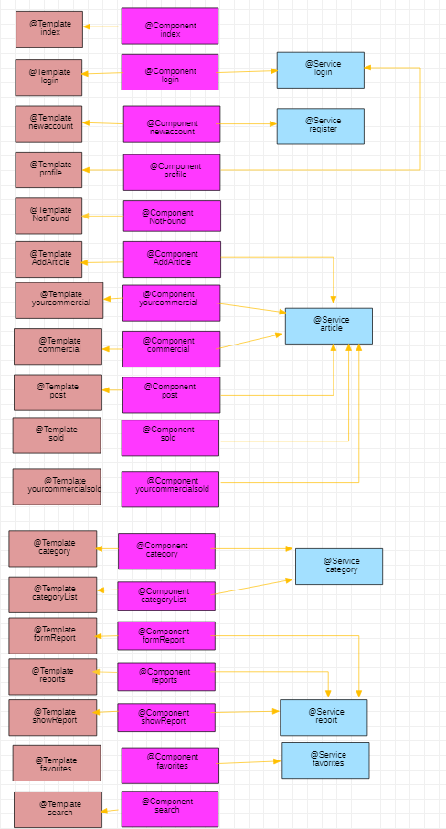

# APP: WALLYPOP

### "En busca de Wally"

### Nos gusta que no se malgasten recursos, por esta razón nuestra app favorece la rehutilización de los productos, frente a deshacerse de ellos y adquirir nuevos productos.
### Nuestra app pondrá en contacto a las personas para ayudarles en el intecambio de productos.

# Fase 0

## Nombre de equipo y logo

## Eslogan

### "Nos gusta ser libres a la vez que responsables y el trabajo bien hecho"

## Equipo de desarrollo - Grupo 4
| Nombre	| Email	| Github |
| --- | :---: | :---: |
|Jesús Barcia Ares| j.barcia.2019@alumnos.urjc.es| jbarcia2019|
|Sergio Gómez García |s.gomezg.2019@alumnos.urjc.es|sergio-gomezg|
|Juan Diez del Corral Ramos |j.diez.2019@alumnos.urjc.es|Juandiezdc|
|Iván Martín Gómez |i.martingo.2016@alumnos.urjc.es|IvanmgmSoftwareEngineering|

## Trello

https://trello.com/b/CO5xGXpN/daw-2021-2022

 ## **Temática** 
 * Tienda de compra/venta de productos de segunda mano.

## Aspectos principales

### Entidades
* **Usuarios:** Podremos encontrar tres tipos de usuarios, no registrados, registrados y administradores.
* **Anuncio:** Está relacionado con los usuarios, ya que estos serán los que podrán poner artículos a la venta o comprar los de otros usuarios.
* **Reportes:** Los usuarios pueden realizar reportes de anuncios o de usuarios fraudulentos. Para ello tendrán un cuadro de diálogo en el que especificar el motivo, un email de contacto y subir alguna imagen como prueba del reporte.
* **Categorías:** Podremos encontrar las distintas categorías de los productos que se encuentran anunciados.

### Permisos de los usuarios
* **Usuarios no registrados:** Podrán ver los artículos puestos a la venta, pero no podrán realizar ni compras ni ventas.
* **Usuarios registrados:** Podrán ver los artículos puestos a la venta, y además podrán vender un producto o comprar el de otro usuario.
* **Administradores:** Podrán ver los artículos puestos a la venta, los usuarios registrados y podrán eliminar productos y usuarios.

### Imágenes
* **Imágenes de perfil:** Los usuarios registrados y administradores podrán establecer una imagen de perfil.
* **Imágenes de productos:** Los usuarios registrados podrán subir imágenes junto a los productos que pongan a la venta.

### Gráficos
* **Gráfica ranking usuarios con más ventas:** se podrá consultar los usuarios que más ventas han realizado.
* **Gráfico peores usuarios:** (visible para el administrador) se podrá consultar que usuarios han recibido más reportes y en el caso de que sean malos usuarios se pueda suspender su cuenta.

### Tecnología complementaria
* **Envío de correos electrónicos:** Podremos comunicarnos con los usuarios a través del uso del correo electrónico para realizar la compra-venta.
* **Localización por mapas:** Podremos ver la ubicación aproximada del producto que queremos adquirir.

### Algoritmo o consulta avanzada
* Búsqueda de artículos por una o varias etiquetas de categorías
* La web recomendará a los usuarios productos similares a los adquiridos anteriormente

# Fase 1

## Pantalla principal

### Esta será la primera pantalla que vean los usuarios al acceder a la web

## Añadir producto

### Los usuarios registrados podrán subir un producto visible por el resto de usuarios

## Añadir categoría

### El administrador podrá añadir una nueva categoría visible para el resto de usuarios

## Listado de categorías

### El administrador podrá visualizar las categorías añadidas por él previamente 

## Recuperar contraseña

### Los usuarios podrán recuperar la contraseña de su cuenta en caso de olvidarla

## Listado de productos

### Los usuarios podrán visualizar todos los productos subidos subidos que no estén vendidos

## Formulario de denuncias

### Los usuarios podrán rellenar un formulario de denuncia en el caso de considerar un producto inapropiado

## Gráfico

### Se podrá ver un grafico con el ranking de usuarios que mas han vendido tanto mensualmente como su histórico

## Pantalla de ayuda

### Los usuarios podrán consultar una pantalla de ayuda en caso de tener alguna duda

## Iniciar sesión

### Los usuarios registrados y el administrador podrán iniciar sesión para acceder a su cuenta

## Registrarse

### Los usuarios no registrados podrán hacerse una cuenta en la web

## Perfil usuario

### Pantalla que verán los usuarios registrados

## Perfil administrador

### Pantalla que verá el administrador

## Publicación

### Pantalla que podrán ver los usuarios con la información del producto seleccionado
### Los usuarios no registrados verán solo los botones verdes, al igual que los registrados si el producto es de otro usuario o todos los botones si es un artículo propio, al igual que el administrador

## Listado de reportes

### El administrador podrá consultar las denuncias recibidas por los usuarios

## Visualizar reporte

### El administrador podrá consultar las pruebas adjuntas a la denuncia seleccionada

## Tus productos

### Los usuarios podrán ver los productos que han subido a su perfil

## Tus productos vendidos

### Los usuarios podrán ver los productos que han subido a su perfil y que ya se hayan vendido

## Diagrama de navegación

# Fase 2

## Diagrama de Bases de datos

## Diagrama de clases y templates

## Diagrama de navegación actualizado

## Contribución miembros equipo

### Contribución Jesús:

#### Descripción textual

##### Diseño base de datos
##### Usuarios (entidad, login, registro, perfil)
##### Entidad de favorites
##### Securizar aplicaci?n
##### Generar certificado jks
##### Mapas
##### Envío de correos electrónicos
##### Mostrar detalle de cada artículo publicado (reservar, vender, eliminar)
##### Migraci?n a PostgreSQL
##### Menús html y footer

#### 5 Commits más significativos:

##### Registro funcionando: https://github.com/CodeURJC-DAW-2021-22/webapp4/commit/b7a6c7414f36a81cffe26e1f2402954133d6b0eb
##### Envío de correos electrónicos: https://github.com/CodeURJC-DAW-2021-22/webapp4/commit/407ff4441023080f7d8c861946d124cefd6252cc
##### Mapas: https://github.com/CodeURJC-DAW-2021-22/webapp4/commit/5eb75b47eb04021b5d838486af7ae37ba2f6034a
##### Encriptado de las contrase?as: https://github.com/CodeURJC-DAW-2021-22/webapp4/commit/407ff4441023080f7d8c861946d124cefd6252cc
##### Certificado jks propio: https://github.com/CodeURJC-DAW-2021-22/webapp4/commit/407ff4441023080f7d8c861946d124cefd6252cc

#### 5 ficheros mayor participaci?n:

##### https://github.com/CodeURJC-DAW-2021-22/webapp4/blame/main/backend/src/main/java/es/codeurjc/wallypop/controller/WallypopWebController.java
##### https://github.com/CodeURJC-DAW-2021-22/webapp4/blob/main/backend/src/main/java/es/codeurjc/wallypop/security/WebSecurityConfig.java
##### https://github.com/CodeURJC-DAW-2021-22/webapp4/blob/main/backend/src/main/resources/templates/post.html
##### https://github.com/CodeURJC-DAW-2021-22/webapp4/blob/main/backend/src/main/java/es/codeurjc/wallypop/service/MapService.java
##### https://github.com/CodeURJC-DAW-2021-22/webapp4/blob/main/backend/src/main/java/es/codeurjc/wallypop/controller/UserController.java

### Contribución Iván:

#### Descripción textual

##### He participado en la implementación de la funcionalidad de añadir nuevos art?culos (formulario, botón enviar) a la base de datos.
##### He participado en la implementación de la funcionalidad de cargar artículos almacenados en la base de datos para mostarlos al usuario.
##### Mostrar mensaje de Enhorabuena!... cuando un artículo es almacenado con ?xito en la base datos.
##### Redacción y e intento de descarga de documento de T&C (Terms and Conditions)
##### Intento de implementaci?n de paginación con AJAX
##### Añadir datos de prueba a la base datos de art?culos (+5 categorías y +11 artículos)
##### Realizado el diagrama de clases y templates

#### 5 Commits más significativos:

##### Cargar datos desde la base de datos en orden inverso: https://github.com/CodeURJC-DAW-2021-22/webapp4/commit/92fb7e7b8669327e66fa8310b898769463b86599
##### Mensaje enhorabuena y solución de problemas: https://github.com/CodeURJC-DAW-2021-22/webapp4/commit/67e119a898c13a5df04d1d618d903c2925845e22
##### Quitar botones paginación simple, añadir nuevo botón "Más resultados": https://github.com/CodeURJC-DAW-2021-22/webapp4/commit/92fb7e7b8669327e66fa8310b898769463b86599
##### Añadir progress bar: https://github.com/CodeURJC-DAW-2021-22/webapp4/commit/ac017cc0bb688609f34474c268814cb150d0620b
##### Añadir +5 categorías y +11 art?culos a la base de datos (paso previo a la implementación de la paginación con AJAX) https://github.com/CodeURJC-DAW-2021-22/webapp4/commit/baffa3426997521405ec57ceafe75c54dfc139d4

#### 5 ficheros mayor participación:

##### https://github.com/CodeURJC-DAW-2021-22/webapp4/blob/FNI_Article_3/backend/src/main/java/es/codeurjc/wallypop/controller/WallypopWebController.java
##### https://github.com/CodeURJC-DAW-2021-22/webapp4/blob/FNI_Article_3/backend/src/main/java/es/codeurjc/wallypop/controller/DataBaseUsage.java
##### https://github.com/CodeURJC-DAW-2021-22/webapp4/blob/FNI_Article_3/backend/src/main/java/es/codeurjc/wallypop/service/ArticleService.java
##### https://github.com/CodeURJC-DAW-2021-22/webapp4/blob/FNI_Article_3/backend/src/main/resources/templates/adcommercial.html
##### https://github.com/CodeURJC-DAW-2021-22/webapp4/blob/FNI_Article_3/backend/src/main/resources/templates/yourcommercial.html

### Contribución Sergio:

#### Descripción textual

##### He hecho que un administrador pueda añadir nuevas categorias
##### He hecho que un administrador pueda eliminar categorias
##### He ayudado a implementar los favoritos
##### He añadido datos de ejemplo a la base de datos para comprobar el uso correcto del añadir y eliminar categorias
##### He realizado el diagrama de navegación
##### He implementado que un usuario pueda modificar el nombre, contraseña y telefono de su perfil

#### 5 Commits más significativos:

##### Modificar datos de los usuarios: https://github.com/CodeURJC-DAW-2021-22/webapp4/commit/d3dbf0034dfdcfc2c5706aa81e1e0deeec823bb2
##### Añadir y eliminar favoritos: https://github.com/CodeURJC-DAW-2021-22/webapp4/commit/14897b6be8888828be30363b54d2f03fbc9fdfed
##### Eliminar categorias a los articulos: https://github.com/CodeURJC-DAW-2021-22/webapp4/commit/904517997bea056f4d2d0dc36eef6df3f6f66815
##### Cargar articulos asociados a una categoria seleccionada en la pantalla principal: https://github.com/CodeURJC-DAW-2021-22/webapp4/commit/5fcf1532bf9264206142938235d82d0edfc26169
##### Mostrar categorias en la pantalla principal: https://github.com/CodeURJC-DAW-2021-22/webapp4/commit/aa713690a0fb9baac59ce4b22d1207591695d3eb

#### 5 ficheros mayor participación:

##### https://github.com/CodeURJC-DAW-2021-22/webapp4/blame/FIX_AND_NEW_IMPLEMENTATIONS/backend/src/main/java/es/codeurjc/wallypop/model/Category.java
##### https://github.com/CodeURJC-DAW-2021-22/webapp4/blame/FIX_AND_NEW_IMPLEMENTATIONS/backend/src/main/java/es/codeurjc/wallypop/controller/DataBaseUsage.java
##### https://github.com/CodeURJC-DAW-2021-22/webapp4/blame/FIX_AND_NEW_IMPLEMENTATIONS/backend/src/main/java/es/codeurjc/wallypop/controller/WallypopWebController.java
##### https://github.com/CodeURJC-DAW-2021-22/webapp4/blame/FIX_AND_NEW_IMPLEMENTATIONS/backend/src/main/resources/templates/modifyDataUser.html
##### https://github.com/CodeURJC-DAW-2021-22/webapp4/blame/FIX_AND_NEW_IMPLEMENTATIONS/backend/src/main/resources/templates/index.html

### Contribución Juan:

#### Descripción textual

##### He participado en la creacion y guardado en base de datos de los formularios de reporte
##### He participado en la lista de reportes que debe salir de la base de datos para mostrarse al administrador
##### He participado en la visualizacion individual de los reportes que permite al administrador aceptarlo o rechazarlo
##### He participado en la creacion y borrado de favoritos 

#### 5 Commits más significativos:

##### Rellenar formulario de reportes y enviarlo a la base de datos. https://github.com/CodeURJC-DAW-2021-22/webapp4/commit/8c57c2277999f69edc5648367537af2456d0f960
##### Mostrar lista de reportes al administrador. https://github.com/CodeURJC-DAW-2021-22/webapp4/commit/0ef1d4185c030ab3e1f5e6975f499d5cdb984df8
##### Visualizar Reporte completo.https://github.com/CodeURJC-DAW-2021-22/webapp4/commit/9c32a53c28d3b50db5028c883ffdfad3bbd621b4
##### Funcionalidad de eliminar articlo reportado o eliminar reporte.https://github.com/CodeURJC-DAW-2021-22/webapp4/commit/bed1f9db220cb8c52eb243809f2b63ca504b9b65
##### Añadir articlos favoritos a la lista de favoritos de un usuario.https://github.com/CodeURJC-DAW-2021-22/webapp4/commit/019a78bcc6cadc81bc84c2144cedcc746f1c1bcd

#### 5 ficheros mayor participación:

##### https://github.com/CodeURJC-DAW-2021-22/webapp4/blob/FNI_Favorites/backend/src/main/java/es/codeurjc/wallypop/controller/WallypopWebController.java
##### https://github.com/CodeURJC-DAW-2021-22/webapp4/blob/FNI_Favorites/backend/src/main/java/es/codeurjc/wallypop/service/FavoritesService.java
##### https://github.com/CodeURJC-DAW-2021-22/webapp4/blob/FNI_Favorites/backend/src/main/resources/templates/VisualizaReporte.html
##### https://github.com/CodeURJC-DAW-2021-22/webapp4/blob/FNI_Favorites/backend/src/main/resources/templates/reportesAdmin.html
##### https://github.com/CodeURJC-DAW-2021-22/webapp4/blob/FNI_Favorites/backend/src/main/resources/templates/formularioReporte.html

# Intrucciones ejecución

* JavaSE 17
* Spring Boot
* Docker (Base de datos PostgreSQL): docker run -d --name postgres-server -p 5433:5432 -e "POSTGRES_PASSWORD=password" postgres
* Docker Hub: docker run -d --publish 8443:8443 jesusbarcia/codeurjc-daw-2021-22-webapp4
* Heroku: https://codeurjc-daw-2021-22-webapp4.herokuapp.com/

## Dependencias Maven: 
* **org.springframework.boot:**
   * spring-boot-starter-data-jpa
   * spring-boot-starter-mustache
   * spring-boot-starter-web
   * spring-boot-starter-security
   * spring-boot-devtools
* **com.h2database:** 
   * H2 (Sólo en el caso de que se ejecute la aplicación sobre H2, en lugar de sobre PostgreSQL)
* **org.postgresql**
   * postgresql
* **com.sun.mail:**
   * javax.mail (v1.6.2)

# Fase 3

## Intrucciónes Docker, Docker compose y Heroku
* Docker (Base de datos PostgreSQL): docker run -d --name postgres-server -p 5433:5432 -e "POSTGRES_PASSWORD=password" postgres
* Docker Hub: docker run -d --publish 8443:8443 jesusbarcia/codeurjc-daw-2021-22-webapp4
* Heroku: https://codeurjc-daw-2021-22-webapp4.herokuapp.com/

### Usuarios
* admin: j@j.es 1234
* user: d@d.es 1234

### Docker:
Para crear la imagen docker y subirla a Docker Hub hemos creado un script (create_docker_image.sh) que se encarga de crear la imagen a partir del Dockerfile y subirla a Docker Hub con el nombre que le hemos pasado como parámetro.

### Docker compose
Hemos creado un fichero docker-compose.yml para la ejecución de nuestra aplicación a partir de la imagen subida anteriormente a Docker Hub.
Crea dos contenedores, uno para la aplicación y otro para la base de datos y sirve la web en el puerto 8443.
También hay otro fichero docker-compose-local.yml que hace lo mismo que el anterior a excepción de que en lugar de descargar la imagen de Docker Hub la crea a partir de los ficheros que tenemos en local.

### Heroku
Hemos creado dos scripts, create_heroku_app.sh y deploy_heroku_app.sh. 
El primero se encarga de generar el contenedor en Heroku, crear la base de datos PostgreSQL y configurar las variables de entorno necesarias.
El segundo se encarga de crear la imagen docker a partir del Dockerfile, subirla y desplegar la aplicación totalmente operativa.

## Diagrama de clases y templates

## Contribución miembros equipo

### -> Contribución Iván:

#### Descripción textual

##### He participado en la implementación de la funcionalidad de publicar nuevos anuncios de la API REST.
##### He participado en la implementación de la funcionalidad de cambiar el estado de un anuncio (vendido/reservado) anuncios de la API REST.
##### He participado en la implementación de la funcionalidad de borrar/modificar anuncios de la API REST.
##### He participado en la implementación de mostrar anuncios con métodos pageables de la API REST.
##### Realizado la modificación del diagrama de clases y templates para la FASE 3 (Ampliación del diagrama realizado en la FASE 2)

#### 5 Commits más significativos:

##### Creación controlador de artículos para la API REST: https: //github.com/CodeURJC-DAW-2021-22/webapp4/commit/403889779c7e5dff1cd256979f5b602195bde1fd
##### Primer intento de implementación del método utilizado para módificar un árticulo de la API REST: https: //github.com/CodeURJC-DAW-2021-22/webapp4/commit/9a26c9a8862acfa22b162017d402d5a9be4a57dc2
##### Primer intento de implementación del método utilizado para mostrar árticulos con métodos pageables de la API REST: https: //github.com/CodeURJC-DAW-2021-22/webapp4/commit/622b30cfc56a22f9672a7a4538964c316e27b4ab
##### Pagination con métodos pageables: https: //github.com/CodeURJC-DAW-2021-22/webapp4/commit/6180d875fab39accce19592a21444b4e120d7cea
##### Crear/borrar/modificar anuncios funciona: https://github.com/CodeURJC-DAW-2021-22/webapp4/commit/a114494b0cb46c89deadc08778fc66c3831ca2cc

#### 5 ficheros mayor participación:

##### https://github.com/CodeURJC-DAW-2021-22/webapp4/blob/API_Articles_Merge/backend/src/main/java/es/codeurjc/wallypop/controller/api/ArticleRestController.java
##### https://github.com/CodeURJC-DAW-2021-22/webapp4/blob/API_Articles/backend/src/main/java/es/codeurjc/wallypop/service/ArticleService.java
##### https://github.com/CodeURJC-DAW-2021-22/webapp4/blob/API_Articles/backend/src/main/java/es/codeurjc/wallypop/repository/ArticleRepository.java
##### https://github.com/CodeURJC-DAW-2021-22/webapp4/blob/API_Articles/backend/src/main/java/es/codeurjc/wallypop/model/Article.java
##### https://github.com/CodeURJC-DAW-2021-22/webapp4/blob/API_Articles_2/README.md

### -> Contribución Jesús:

#### Descripción textual

##### Creación de la api de usuarios (GET, POST, PUT y DELETE)
##### GET de artículos para un usuario propio
##### Creación de algunos métodos para las api de los administradores para los distintos modelos
##### Resolver problema con las recursión infinitas al hacer un GET debido a las relaciones entre modelos
##### Securizar todas las urls de la api
##### Añadir seguridad al uso de la api con JWT
##### Sustitución del envío de la contraseña en claro por la generación de un token único
##### Dockerizar aplicación y despliegue en Heroku
##### Clase java para coger la URI de la base de datos de Heroku
##### Reintentos de conexión a la base de datos cuando no está disponible

#### 5 Commits más significativos:

##### https://github.com/CodeURJC-DAW-2021-22/webapp4/commit/d071b45d1cda31b9da07487b08b188f9c9c7fd22
##### https://github.com/CodeURJC-DAW-2021-22/webapp4/commit/bc5b798308f41ea9eda3b17ae0fe324ee684ae7d
##### https://github.com/CodeURJC-DAW-2021-22/webapp4/commit/6aab8e9657ced95d9ebbdcf9f4b49332bcbae429
##### https://github.com/CodeURJC-DAW-2021-22/webapp4/commit/f2cf8ed74c929cf1b546e2af6bc3032fce69f84f
##### https://github.com/CodeURJC-DAW-2021-22/webapp4/commit/846d01f4714a867533fac090bc28e4a92b859b13

#### 5 ficheros mayor participación:

##### https://github.com/CodeURJC-DAW-2021-22/webapp4/tree/main/backend/src/main/java/es/codeurjc/wallypop/dto
##### https://github.com/CodeURJC-DAW-2021-22/webapp4/blob/main/backend/src/main/java/es/codeurjc/wallypop/security/RestSecurityConfig.java
##### https://github.com/CodeURJC-DAW-2021-22/webapp4/blob/main/backend/src/main/java/es/codeurjc/wallypop/controller/api/UserRestController.java
##### https://github.com/CodeURJC-DAW-2021-22/webapp4/blob/main/backend/src/main/java/es/codeurjc/wallypop/controller/api/admin/AdminUserRestController.java
##### https://github.com/CodeURJC-DAW-2021-22/webapp4/blob/main/backend/deploy_heroku_app.sh

### -> Contribución Juan:

#### Descripción textual

##### Creación de la api de reportes (GET, POST, PUT y DELETE para los reportes y/o los articulos reportados)
##### Creación de la api del grafico (GET)
##### Creación de los ficheros POSTMAN de reportes y grafico

#### 5 Commits más significativos:

##### Añadir ficheros POSTMAN de Grafico y Reportes: https://github.com/CodeURJC-DAW-2021-22/webapp4/commit/46e16c22cf629a60cd824c4570c222ec3115a102
##### API del Grafico:https://github.com/CodeURJC-DAW-2021-22/webapp4/commit/54ef9eb5e6a57b702cbab2a9667688aaa59f7c02
##### Descarga de archivos de reportes en API:https://github.com/CodeURJC-DAW-2021-22/webapp4/commit/d43b39a463ac7630f6749d3b86ba384e6c8b6c46
##### API de Reportes:https://github.com/CodeURJC-DAW-2021-22/webapp4/commit/51dee9c9c8f9386a10c6ada74051a1c6462bd9c3
##### Solucion de errores y adicion de metodos en los reportes:https://github.com/CodeURJC-DAW-2021-22/webapp4/commit/e5b0ae058a9f5b87b4719a75c29617eb438dc413

#### 5 ficheros mayor participación:

##### https://github.com/CodeURJC-DAW-2021-22/webapp4/blob/develop/Graphic.postman_collection.json
##### https://github.com/CodeURJC-DAW-2021-22/webapp4/blob/develop/Reports.postman_collection.json
##### https://github.com/CodeURJC-DAW-2021-22/webapp4/blob/develop/backend/src/main/java/es/codeurjc/wallypop/controller/api/GraphicRestController.java
##### https://github.com/CodeURJC-DAW-2021-22/webapp4/blob/develop/backend/src/main/java/es/codeurjc/wallypop/controller/api/ReportRestController.java
##### https://github.com/CodeURJC-DAW-2021-22/webapp4/blob/develop/backend/src/main/java/es/codeurjc/wallypop/service/ReportService.java

### -> Contribución Sergio:

#### Descripción textual

##### Creación de la api de categorias (GET, POST, PUT y DELETE para la informacion de la categorias y, GET, POST y DELETE para las imagenes de las categorias)
##### Creación de la api de favoritos (GET, POST y DELETE)
##### Creación de los ficheros POSTMAN de favoritos y categorias

#### 5 Commits más significativos:

##### Añadir ficheros POSTMAN de favoritos y categorias: https://github.com/CodeURJC-DAW-2021-22/webapp4/commit/d4edb9fe7892a78cb67b54265e9bc91832f52395
##### Api de categorias: https://github.com/CodeURJC-DAW-2021-22/webapp4/commit/2323f112cca16532577c1fd26e728f8bf3d8cfb4
##### Api de favoritos: https://github.com/CodeURJC-DAW-2021-22/webapp4/commit/ce44346df678963dc53cd22e0a999200664552dc
##### Metodos para imagenes de categorias: https://github.com/CodeURJC-DAW-2021-22/webapp4/commit/ed7585802a7d125d585268e30355f805ad31d039
##### Añadir favorito si no está y eliminar favorito si está con el metodo POST: https://github.com/CodeURJC-DAW-2021-22/webapp4/commit/3004e9de7f6ed5dbc135c2f6f747a257e04ba106

#### 5 ficheros mayor participación:

##### https://github.com/CodeURJC-DAW-2021-22/webapp4/blame/main/backend/src/main/java/es/codeurjc/wallypop/controller/api/admin/AdminCategoryRestController.java
##### https://github.com/CodeURJC-DAW-2021-22/webapp4/blame/main/backend/src/main/java/es/codeurjc/wallypop/controller/api/admin/AdminFavoritesRestController.java
##### https://github.com/CodeURJC-DAW-2021-22/webapp4/blame/main/backend/src/main/java/es/codeurjc/wallypop/service/CategoryService.java
##### https://github.com/CodeURJC-DAW-2021-22/webapp4/blame/main/Category.postman_collection.json
##### https://github.com/CodeURJC-DAW-2021-22/webapp4/blame/main/Favorites.postman_collection.json

# Fase 4

Para poder desarrollar la aplicación hemos necesitado de Node.js, Angular CLI, Java, Maven.
Hemos usado las librerias de HighChart para poder mostrar los gráficos y la de Leaflet para poder mostrar el mapa.

## Intrucciónes Docker, Docker compose y Heroku
* Docker (Base de datos PostgreSQL): docker run -d --name postgres-server -p 5432:5432 -e "POSTGRES_PASSWORD=password" postgres
* Docker Hub: docker run -d --publish 8443:8443 jesusbarcia/codeurjc-daw-2021-22-webapp4
* Heroku: https://codeurjc-daw-2021-22-webapp4b.herokuapp.com/new/
* Heroku - angular: https://codeurjc-daw-2021-22-webapp4b.herokuapp.com/new/

### Usuarios
* admin: j@j.es 1234
* user: d@d.es 1234

### Docker:
Para crear la imagen docker y subirla a Docker Hub hemos creado un script (create_docker_image.sh) que se encarga de crear la imagen a partir del Dockerfile y subirla a Docker Hub con el nombre que le hemos pasado como parámetro.

### Docker compose
Hemos creado un fichero docker-compose.yml para la ejecución de nuestra aplicación a partir de la imagen subida anteriormente a Docker Hub.
Crea dos contenedores, uno para la aplicación y otro para la base de datos y sirve la web en el puerto 8443.
También hay otro fichero docker-compose-local.yml que hace lo mismo que el anterior a excepción de que en lugar de descargar la imagen de Docker Hub la crea a partir de los ficheros que tenemos en local.

### Heroku
Hemos creado dos scripts, create_heroku_app.sh y deploy_heroku_app.sh. 
El primero se encarga de generar el contenedor en Heroku, crear la base de datos PostgreSQL y configurar las variables de entorno necesarias.
El segundo se encarga de crear la imagen docker a partir del Dockerfile, subirla y desplegar la aplicación totalmente operativa.

## Diagrama de clases y templates

## Vídeo
https://youtu.be/EoRRqiUNdjM

### -> Contribución Iván

#### Descripción textual

##### He participado en la creación de la estructura de directorios relacionada con Article (Componentes, Modelo y Servicio)
##### He participado en la implementación de la funcionalidad de publicar nuevos anuncios en la SPA con Angular.
##### He participado en la implementación de la funcionalidad de listar anuncios de un User en la SPA con Angular.
##### He participado en la realización del diagrama de la Fase 4.

#### 5 Commits más significativos

##### Creación estructura para articles (componentes, servicio y modelo): https://github.com/CodeURJC-DAW-2021-22/webapp4/commit/fa779fbe59f0226a4ee688fb119019e0ccf563bd
##### Añadido componente 1: https://github.com/CodeURJC-DAW-2021-22/webapp4/commit/5cdab28e03139bf20fb9e9b5d82d9e04837660cb
##### Mejoras componente 1: https://github.com/CodeURJC-DAW-2021-22/webapp4/commit/0aa57c24ebe141d8fbf83d0f95dd5f6e9914b2e4
##### Añadido componente 3: https://github.com/CodeURJC-DAW-2021-22/webapp4/commit/8618d7a58afac806e0133e3ef1e7409bb538a1cd
##### Arreglar errores componente 1: https://github.com/CodeURJC-DAW-2021-22/webapp4/commit/02514adf392a169f8bf7f473134a6d0009d92c73

#### 5 ficheros mayor participación

##### https://github.com/CodeURJC-DAW-2021-22/webapp4/blob/angular_article/angular/wallypop/src/app/components/article/AddArticle.component.html
##### https://github.com/CodeURJC-DAW-2021-22/webapp4/blob/angular_article/angular/wallypop/src/app/components/article/AddArticle.component.ts
##### https://github.com/CodeURJC-DAW-2021-22/webapp4/blob/angular_article/angular/wallypop/src/app/components/article/ArticlesUserPagination.component.html
##### https://github.com/CodeURJC-DAW-2021-22/webapp4/blob/angular_article/angular/wallypop/src/app/components/article/ArticlesUserPagination.component.ts
##### https://github.com/CodeURJC-DAW-2021-22/webapp4/blob/angular_article/angular/wallypop/src/app/services/article.service.ts

### -> Contribución Sergio

#### Descripción textual

##### Implementación del añadir una nueva categoria con foto
##### Implementación de mostrar las categorias creadas en la pagina de categoryList
##### Implementación del eliminar articulo
##### Implementacion del modelo y servicio de categorias

#### 5 Commits más significativos

##### Eliminar una categoria: https://github.com/CodeURJC-DAW-2021-22/webapp4/commit/a0e3b89da8450466d52728080360ceac759a5b7f
##### Añadir una categoria con foto: https://github.com/CodeURJC-DAW-2021-22/webapp4/commit/dac9f17a83ee26b317a89dbda8f682fafe622d58
##### Eliminar un articulo: https://github.com/CodeURJC-DAW-2021-22/webapp4/commit/f026ec8838e236b2af6161deb86b3dbb0a93fea0
##### Mostrar la lista de categorias en categoryList sin foto: https://github.com/CodeURJC-DAW-2021-22/webapp4/commit/4d6902cb723a7fa5bcc2a3ab2e6db9ab96317099
##### Modelo de categorias: https://github.com/CodeURJC-DAW-2021-22/webapp4/commit/c55a35c0c527c14676af0280ca5fe87e8119a8f6

#### 5 ficheros mayor participación

##### https://github.com/CodeURJC-DAW-2021-22/webapp4/blame/angular_categories/angular/wallypop/src/app/services/category.service.ts
##### https://github.com/CodeURJC-DAW-2021-22/webapp4/blame/angular_categories/angular/wallypop/src/app/components/category/categoryList.component.ts
##### https://github.com/CodeURJC-DAW-2021-22/webapp4/blame/angular_categories/angular/wallypop/src/app/components/category/category.component.html
##### https://github.com/CodeURJC-DAW-2021-22/webapp4/blame/angular_categories/angular/wallypop/src/app/components/category/categoryList.component.html
##### https://github.com/CodeURJC-DAW-2021-22/webapp4/blame/angular_categories/angular/wallypop/src/app/components/category/category.component.ts

### -> Contribución Juan

#### Descripción textual

##### Implementación del formulario de reportes
##### Implementación de la lista de reportes para el admin
##### Implementación del ver reporte para el admin
##### Participacion en la funcionalidad de crear nuevos anuncios

#### 5 Commits más significativos

##### Finalizacion de Formulario de reportes y ver reportes:https://github.com/CodeURJC-DAW-2021-22/webapp4/commit/2535b9267d65ddf4179d5f2c6b1105b28a9dab0c
##### Lista de reportes para el admin:https://github.com/CodeURJC-DAW-2021-22/webapp4/commit/06f6e6e7c11cc5bd52e5842b653446590b12fbe9
##### Report service y creacion del formulario de reportes:https://github.com/CodeURJC-DAW-2021-22/webapp4/commit/711668c629f92bcc59662882111643b566a3033c
##### Lista de reportes creacion:https://github.com/CodeURJC-DAW-2021-22/webapp4/commit/7a7627696261e8f7d31c988d0f8a3abe116655ab
##### Modelo de reportes:https://github.com/CodeURJC-DAW-2021-22/webapp4/commit/e45206e3aa9688469d7c77b01c71bd3cbd37a242

#### 5 ficheros mayor participación

##### https://github.com/CodeURJC-DAW-2021-22/webapp4/blob/angular/angular/wallypop/src/app/components/report/formReport.component.html
##### https://github.com/CodeURJC-DAW-2021-22/webapp4/blob/angular/angular/wallypop/src/app/components/report/formReport.component.ts
##### https://github.com/CodeURJC-DAW-2021-22/webapp4/blob/angular/angular/wallypop/src/app/components/report/reports.component.html
##### https://github.com/CodeURJC-DAW-2021-22/webapp4/blob/angular/angular/wallypop/src/app/components/report/reports.component.ts
##### https://github.com/CodeURJC-DAW-2021-22/webapp4/blob/angular/angular/wallypop/src/app/components/report/showReport.component.ts

### -> Contribución Jesús

#### Descripción textual

##### Modelo User
##### Mostrar todos los anuncios disponibles, el detalle de cada anuncio, reservar, vender, enviar email de contacto
##### Búsqueda de artículos tanto por título y descripción como por ciudad
##### Iniciar sesión y registrarse
##### Ver perfil del usuario
##### Securizar aplicación para que los usuarios no logueados o que no son administradores accedan a páginas que no deben
##### Añadir favoritos
##### Mostrar en un mapa la localización del anuncio publicado
##### Dockerizar y desplegar la aplicación

#### 5 Commits más significativos

##### Mis anuncios, mis anuncios vendidos y todos los anucios vendidos https://github.com/CodeURJC-DAW-2021-22/webapp4/commit/c67aa02765c59eb46832ee8a326ceded63c3c6b5
##### Mapa https://github.com/CodeURJC-DAW-2021-22/webapp4/commit/54e0b632d1df5cbeeafbc4fae05de0eb367d3a86
##### Filtrado de artículos por categoría https://github.com/CodeURJC-DAW-2021-22/webapp4/commit/b4dc24c97d9588bf2df518232bb47820c29858b2
##### Mostrar detalle de un artículo https://github.com/CodeURJC-DAW-2021-22/webapp4/commit/46680aecd5476b784f2965b9de68460df5097581 || https://github.com/CodeURJC-DAW-2021-22/webapp4/commit/0015b787330d1e880702184a0dbf094ced4d6b25
##### Incluir frontend en Spring https://github.com/CodeURJC-DAW-2021-22/webapp4/commit/3269e8f43c6a7a9ec200fdeb9b97e83586020648

#### 5 ficheros mayor participación

##### https://github.com/CodeURJC-DAW-2021-22/webapp4/blame/main/frontend/wallypop/src/app/services/article.service.ts
##### https://github.com/CodeURJC-DAW-2021-22/webapp4/blob/main/frontend/wallypop/src/app/services/login.service.ts
##### https://github.com/CodeURJC-DAW-2021-22/webapp4/blob/main/frontend/wallypop/src/app/components/articles/post.component.ts
##### https://github.com/CodeURJC-DAW-2021-22/webapp4/blame/main/frontend/wallypop/src/app/components/articles/addcommercial.component.ts
##### https://github.com/CodeURJC-DAW-2021-22/webapp4/blob/main/frontend/wallypop/src/app/components/articles/commercial.component.ts

## Licencia
[APACHE](https://github.com/CodeURJC-DAW-2021-22/webapp4/blob/26b1d22bc7625b0dd8cdb3a3b8eaf7bb5425833b/LICENSE)
